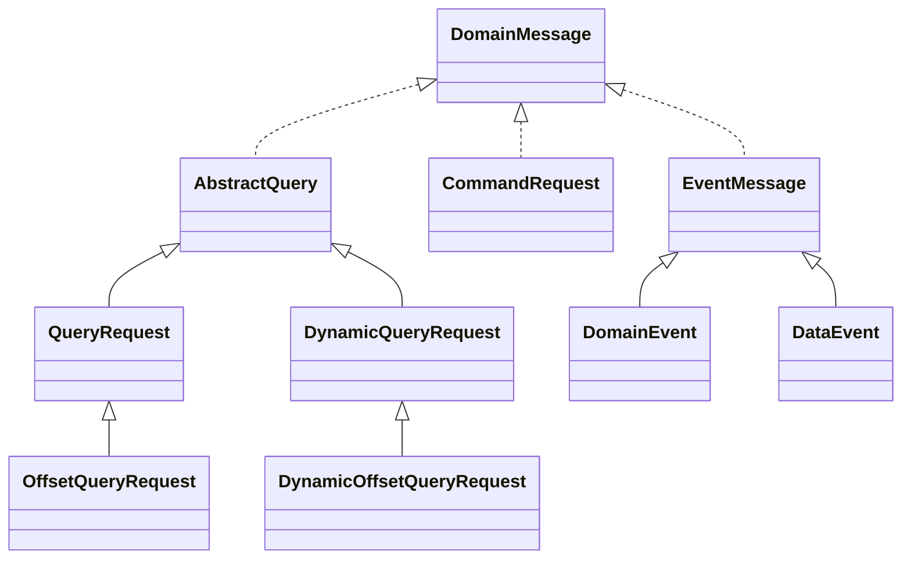

# accent

The accent provides a basic types and ubiquitous language for developing drama on
[NARA Way](https://naraway.io). For a detailed usage or guide document, please see
[NARA Way](https://naraway.io).

## Features

- Domain base model classes
- Interface for message classes
- Base model classes for kollection and drama
- Tenant base model classes
- Utility classes

## Installation

```groovy
implementation 'io.naraway:accent'
```

## Usage

### Tenants

You can generate IDs for types derived from object ID key values for tenant and workspace types.

```java
public class Clazz {
    //
    public void method() {
        //

        // ...

        // cregate actor key from string
        ActorKey actorKey = ActorKey.fromId("1@1:1:1:1-1");
        log("stage id: ", actorKey.genStageId());
        log("citizen id: ", actorKey.genCitizenId());
        log("pavilion id: ", actorKey.genPavilionId());

        // determine tenant type
        TenantType tenantType = TenantKey.getTenantType("1@1:1:1:1");

        // ...
    }
}
```

Identity rules based on tenant and workspace type are shown below.

| Tenant Type | Sample       |
|-------------|--------------|
| Station     | 1            |
| Square      | 1:1          |
| Pavilion    | 1:1:1        |
| Cineroom    | 1:1:1:1      |
| Backstage   | 1:1:1:1_1    |
| Stage       | 1:1:1:1-1    |
| Denizen     | s5@1:1       |
| Citizen     | s5@1:1:1     |
| Audience    | s5@1:1:1:1   |
| Actor       | s5@1:1:1:1-1 |

### DomainEntity, StageEntity

StageEntities and DomainEntities have an inheritance relationship between
children and parents. Every Domain Model used in the NARA Way will inherit
and implement one of these two.

**DomainEntity:**

A Domain Model without a Stage context that is used by the
platform kernel and not by normal dramas. It only has basic user information
and basic property information for the Entity.

```java
public abstract class DomainEntity implements JsonSerializable {
    //
    private String id;
    private long entityVersion;
    private String registeredBy;
    private long registeredOn;
    private String modifiedBy;
    private long modifiedOn;

    // ...
}
```

**StageEntity:**

The NARA Way Drama service is consumed by Actor users within the Stage workspace.
The DomainEntity becomes a StageEntity with the Stage context property added to
it that the user is working with.

```java
public abstract class StageEntity extends DomainEntity {
    //
    protected ActorKey requesterKey;
    protected String stageId;
    protected String pavilionId;

// ...
```

There is a class type that maps the above two entity objects to JPO objects in an
RDBMS or Document objects in mongo - `DomainEntityJpo`, `StageEntityJpo` or `DomainEntityDoc`,
`StageEntityDoc` under the `store` package.

### JsonSerializable, JsonUtil

Server objects in the NARA Way are used to serialize data in JSON when data is
passed to events or to the front. We provide an Interface and a utility class
for this.

Implementing the JsonSerializable interface gives you access to the `toJson()`
and `toPrettyJson()` methods, and all non-Entity, ValueObject, and DomainMessage
objects must use the JsonSerializable interface.

```java

@Getter
@Setter
@Builder
@NoArgsConstructor
@AllArgsConstructor
public class FooRdo implements JsonSerializable {
    //
    private String name;
    private int age;

    @Override
    public String toString() {
        //
        toJson();
    }

    public FooRdo fromJson(String json) {
        //
        return JsonUtil.fromJson(json, FooRdo.class);
    }

    public static FooRdo sample() {
        //
        return FooRdo.builder()
                .name("John")
                .age(20)
                .build();
    }

    public void main(String[] args) {
        //
        System.out.println(sample().toPrettyJson());
    }
}
```

### ValueObject, ValueGroup

Among DDD domains, `ValueObject` and `ValueGroup` are the interfaces used to define
the value object type. The two types are identical, but can be differentiated by
whether or not they are separated into separate fields when the store object code
called Jpo or Doc is generated by the Studio Tool. When fetching data from the DB,
the value object objects that will be used as search criteria filtering or sorting
are created by implementing a `ValueGroup`.

After implementing `ValueGroup`, the attribute fields in Doc are created as follows.

```java

@Getter
@Setter
@NoArgsConstructor
public class Foo extends StageEntity {
    //
    private Name name;
    private int age;

    // ...
}

@Getter
@Setter
@NoArgsConstructor
@AllArgsConstructor
public class Name implements ValueGroup {
    //
    private String firstName;
    private String lastName;

    // ...
}

// generated doc class
@Getter
@Setter
@NoArgsConstructor
@Document(collection = "Foo")
public class FooDoc extends StageEntityDoc {
    //
    private String nameFirstName; // delived from value group (entity attribute + value group's attribute)
    private String nameLastName; // delived from value group (entity attribute + value group's attribute)
    private int age;

    // ...
}
```

### Message

DomainMessage is the top-level interface of the models used in the NARA Way.
EventMessage for message streams, CommandRequest used in REST, and QueryRequest all
have DomainMessage as their top-level interface. The full inheritance relationship
is as follows.



### Context

Context is an object that is automatically generated by the backend service
based on the token information in the request when the user makes a REST request.
It is created in the request processing thread, so it can be shared during the
request life cycle.

```java
public class ProductFlow {
    //
    // ...

    public void update() {
        //
        StageRequest stageRequest = StageContext.get();

        // StageRequest
        //   - String username;
        //   - UserType userType;
        //   - String displayName;
        //   - String email;
        //   - boolean enabled;
        //   - String actorId;
        //   - String pavilionId;
        //   - List<String> cineroomIds;
        //   - String kollectionId;
        //   - String dramaId;
        //   - List<String> roles;
        //   - Map<String, Object> attributes;
    }
}
```

### Entities

You can generate a list of changed properties from a Domain Entity source and a
changed object. Or you can provide a function for the purpose of generating a
`NameValueList` object.

Getting changed `nameValues` between source and modified entity:

```java
public class Clazz {
    //
    public void method(Foo sourceEntity, Foo modifiedEntity) {
        //

        // ...

        NameValueList nameValue = Entities.getModifiedNameValues(sourceEntity, modifiedEntity);

        // ...
    }
}
```

### Beans

Provides the ability to copy properties between DomainEntity or StageEntity
objects defined in the NARA Way, or to access and change property values through
reflection.

```java
public class Clazz {
    //
    public void method(SomeBean entity) {
        //

        // ...

        // check getter and setter
        boolean hasNameAttributeGetter = Beans.hasGetter(entity, "name");
        boolean hasNameAttributeSetter = Beans.hasSetter(entity, "name");

        // read and write value
        Object name = Beans.readValue(entity, "name");
        Beans.writeValue(entity, "name", "John");

        // copy properties except age and id
        SomeBean newEntity = new SomeBean();
        Beans.copyProperties(entity, newEntity, "age", "id");

        // reflect properties
        List<String> properties = Beans.getProperties(SomeBean.class);

        // ...
    }
}
```

### TinyUUID

A utility class that generates a randomized ID, similar to Java's UUID.
It generates the UUID format as 22 characters of a 64-bit string. It can
also be generated by giving it a prefix.

```java
public class Foo {
    //
    public static void main(String[] args) {
        //
        System.out.println(TinyUUID.random());             // fFKp7aMGkA19ikVIOEK9CX 
        System.out.println(TinyUUID.random("usid"));       // usid_cIV7BQwuQN3bP1WWPnKgIL
        System.out.println(TinyUUID.random("usid", "_D")); // usid_Dco1G2XU14y6aEkXzc4rLbd
    }
}
```

## Getting more help

Visit the Nara Way page to get more information about the library:  
[https://github.com/naraway](https://github.com/naraway)

You can ask any question about Nara Way using the [NARA Way Page](https://www.naraway.io).
